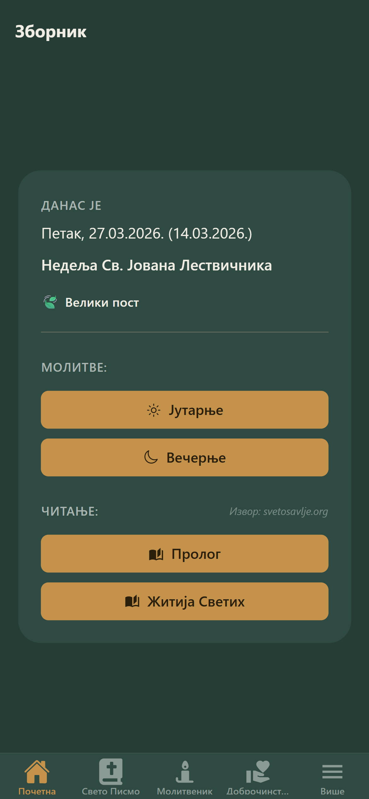
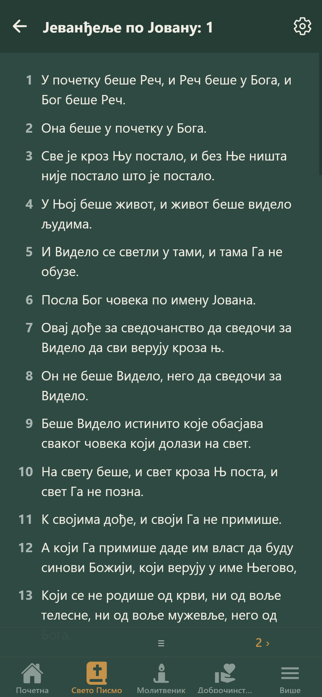
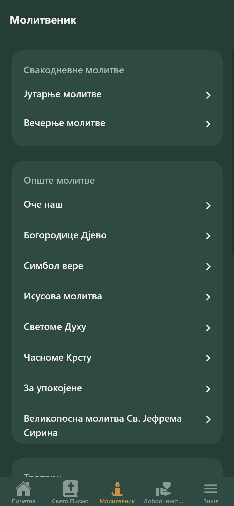
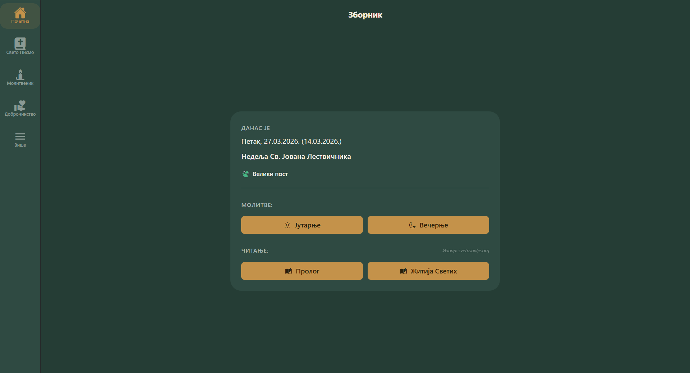
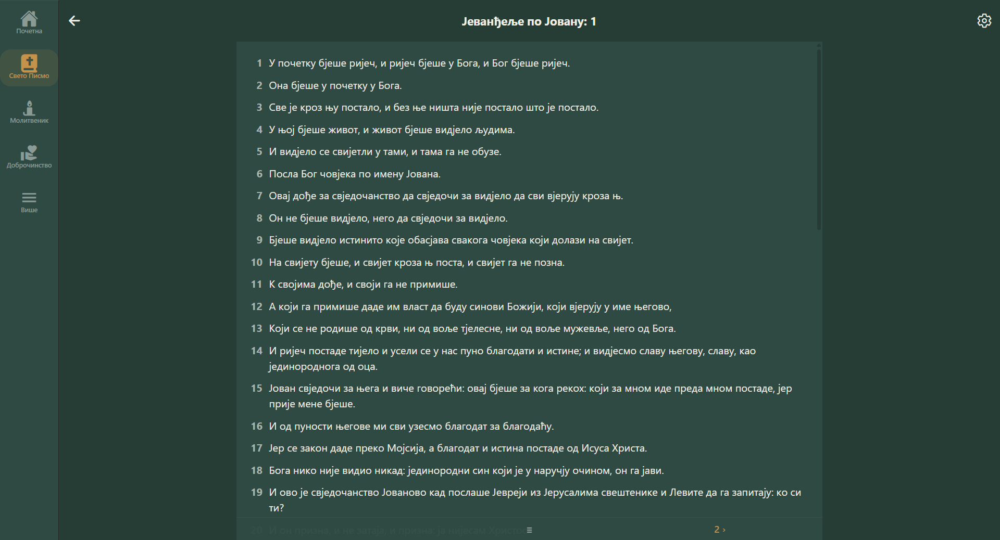
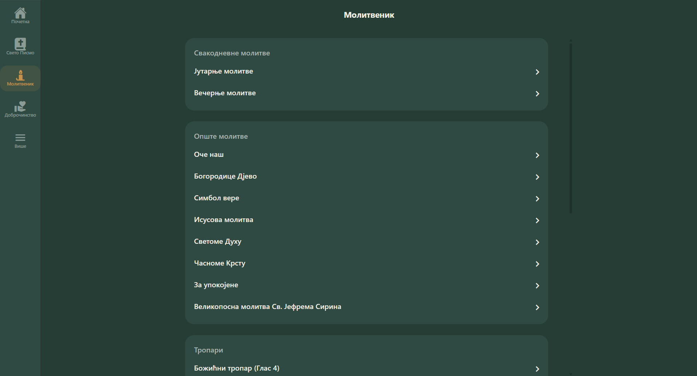

# Zbornik - Orthodox Christian App

**[🇷🇸 Srpski / Serbian](README-sr.md)**

**Zbornik** is an Orthodox Christian mobile and web app (PWA) for daily prayer, Bible reading, and following the liturgical calendar. It provides access to a prayer book, multiple Bible translations, and essential liturgical resources in Serbian (Multilanguage support is planned), all in a simple interface.

🌐 **Live app:** [www.zbornik.net](https://www.zbornik.net) (Soon)

## Screenshots

### Mobile

| Home                                                                   | Bible Reader                                                                   | Prayer Book                                                                   |
| ---------------------------------------------------------------------- | ------------------------------------------------------------------------------ | ----------------------------------------------------------------------------- |
|  |  |  |

### Web

| Home                                                             | Bible Reader                                                             | Prayer Book                                                             |
| ---------------------------------------------------------------- | ------------------------------------------------------------------------ | ----------------------------------------------------------------------- |
|  |  |  |

## Features

- 📖 **Holy Scripture Reading** — Orthodox Bible translations: Serbian (ekavski/ijekavski) and Church Slavonic.
- 🙏 **Prayer Book (sr-Cyrl)** — prayer book in Serbian Cyrillic.
- 📱 **Cross-platform** — PWA and Expo for Android.
- 🌙 **Theme Support** — dark and light theme support.

## Technology Stack

- React Native + Expo
- TypeScript
- Zustand (State Management)
- Expo Router (Navigation)

## Getting Started

### Prerequisites

- Node.js (v20 recommended)
- npm (or use yarn / pnpm)
- Expo CLI (optional globally: `npm install -g expo-cli`)

### Quick Start

```bash
# Install dependencies
npm install

# Start the development server (Metro + Expo)
npm start

# Run on Android emulator or device
npm run android

# Run as web app (PWA)
npm run web
```

## Development Workflow

- Create feature branches and open a PR for changes.
- Run the app locally via `npm start` and test on Android or web.
- Keep TypeScript types and linting green; follow existing code style.

## Useful Commands

- `npm run build` — (if available) build a production bundle.
- `npm test` — run tests (if present).
- `npm run lint` — run ESLint.

## Contributing

- Fork the repo, create a topic branch, and open a pull request.
- Keep PRs focused and include a short description of changes.
- For larger changes, open an issue first to discuss design.

## Where to Look

- App entry and routes: [app/app.tsx](app/app.tsx) and files under app/app/
- Components: [components/](components/)
- Assets (prayers, fonts, images): [app/assets/](app/assets/) and [app/prayer-book/](app/prayer-book/)

## License

GNU General Public License v3.0 - see [LICENSE](LICENSE) file for details.
